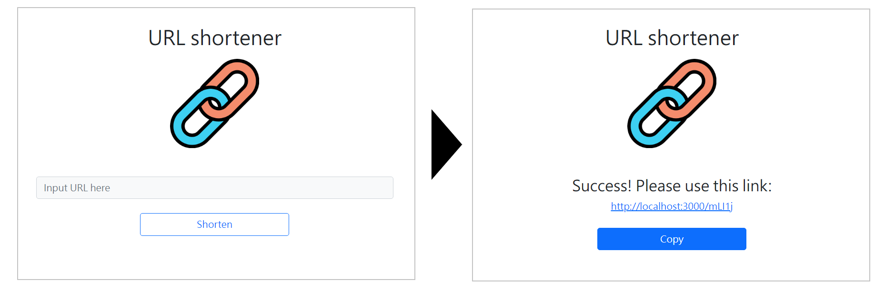

# URL shortener 短網址產生器



## 介紹
產生一組短的網址，以代替原來可能較長的網址，並讓使用者可以在其他地方任意使用。

## 功能
- 使用者可以輸入網址，送出後，畫面會回傳短網址
- 使用者可以點擊Copy按鈕，複製短網址
- 使用者可以透過短網址導連至原本的網址

# 使用方式
1. 確認安裝 node.js 與 npm
2. 將此專案 clone 到本地
3. 透過終端機進入專案資料夾，執行以下指令安裝專案使用套件：
```
npm install
```
4. 執行啟動伺服器：
```
npm run start
```
5. 若終端機出現此行訊息代表伺服器順利運行，打開瀏覽器進入以下網址
```
Express App is running on http://localhost:3000
```
6. 若欲停止使用，請按：
```
ctrl + c
```

# 開發工具
- Node.js 17.0.25
- Express 4.17.3
- Express-Handlebars 3.0.0
- bootstrap 5.1.3
- MongoDB
- mongoose 6.3.0
- body-parser 1.19.2
- valid-url 1.0.9